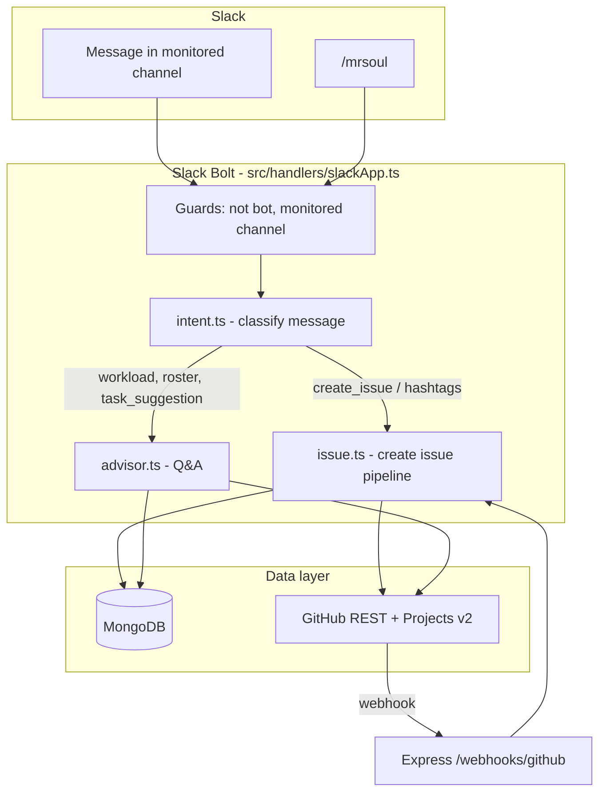

# CE-Tech Automation Platform (MrSoul)

> **Purpose of this document:** Share this README with Claude (or any AI assistant) to understand what this repo does, how messages flow through the system, and where to change behavior.

Internal Slack bot (**MrSoul**) for CE-Tech at The Souled Store. It connects monitored Slack channels to GitHub (`thesouledstore-tss/roadmap`) and the **TSS Product & Tech Master** GitHub Project. Engineers can file issues from Slack, get workload answers, and receive ownership suggestions without leaving the channel.

---

## What happens at a glance

| User does this in Slack | What the bot does |
|-------------------------|-------------------|
| Posts with hashtags (`#refund #urgent …`) | Creates MongoDB issue record → GitHub issue → tracking thread in Slack |
| `@MrSoul` or `@MrSoul help` | Ephemeral guidelines + quick-action buttons (only you see it) |
| `/mrsoul` | Same guidelines (ephemeral slash command) |
| `what is Akriti working on?` (with or without @bot) | **Advisor:** loads open items from GitHub Project, replies in thread |
| `@MrSoul who should work on …` | **Advisor:** triage-style suggestion using routing + GitHub signals |
| `create issue …` in a **thread** | Pulls thread context, creates GitHub issue in that thread |
| GitHub PR opened/merged or issue closed | Webhook updates Slack thread + MongoDB issue status |

---

## System diagram



---

## Startup sequence (`src/index.ts`)

1. Connect MongoDB (`database.ts`)
2. Seed default hashtag → developer mappings (`routing.ts` → `seedDefaults()`)
3. Start Express API on `PORT` (default 3000) — health, REST API, GitHub webhooks
4. Start Slack Bolt app:
   - **Socket Mode** if `SLACK_APP_TOKEN` is set (typical for `npm run dev`)
   - **HTTP mode** on `PORT + 1` otherwise
5. Optionally post/pin channel guidelines if `SLACK_POST_GUIDELINES_ON_START=true`

---

## Slack message handler — decision logic

All logic lives in `src/handlers/slackApp.ts`. Read this file first when debugging Slack behavior.

### Guards (message is ignored if any match)

- Bot messages, edits, deletes
- Messages from `SLACK_BOT_USER_ID`
- Channel not in `SLACK_MONITORED_CHANNELS` (supports channel IDs, names, or `*`)

### Triggers (message is processed if any match)

1. Message contains **hashtags** (e.g. `#refund`)
2. User **@mentions the bot**
3. Natural-language **developer workload** question (e.g. `what is tss-akritiraj working on`)
4. **Thread reply** containing `create issue …`

### Routing inside the handler

```
parseSlackIntent(text)
        │
        ├─ create_issue OR hashtags ──────────► issueService.processSlackMessage()
        │
        ├─ bare @bot / help ───────────────────► ephemeral guidelines (mrsoulGuidelines.ts)
        │
        └─ advisor intents (workload, roster, task_suggestion)
           when @bot OR workload query without @bot
                                              ► advisorService.handleIntent()
                                                 └─ slackService.postAdvisorReply()
```

### Intent types (`src/services/intent.ts`)

| Intent | Example phrases | Handler |
|--------|-----------------|---------|
| `create_issue` | Hashtags, `create issue …` | `issue.ts` |
| `developer_workload` | `what is X working on`, `show X workload` | `advisor.ts` |
| `team_roster` | `who is working on what`, `team status` | `advisor.ts` |
| `task_suggestion` | `who should work on …`, `best person for …` | `advisor.ts` |
| `help` | `help`, `?` | Guidelines blocks |

**Important:** Workload questions are detected **without** requiring `@MrSoul`. Generic `@bot` chat defaults to `task_suggestion`, not help.

---

## Issue creation pipeline (`src/services/issue.ts`)

End-to-end flow when a message becomes an issue:

1. **Dedupe** — MongoDB TTL key `slack:{channelId}:{messageTs}` (5 min window)
2. **Triage** (`triage.ts`) — deterministic assignee scoring (see below)
3. **MongoDB** — `Issue` document with audit log
4. **Parallel work:**
   - **GitHub** (`github.ts`) — create issue in `GITHUB_OWNER/GITHUB_REPO`, link to Projects v2, set squad/effort fields from env
   - **Optional LLM** (`llm.ts`) — summarize body if `LLM_ENABLED=true` and assignee was not obvious from mention/hashtag
   - **Slack thread** (`slack.ts`) — Block Kit tracking message in channel (or existing thread if `threadTs` set)
5. **Workload tracker** (`tracker.ts`) — sync to Notion / Google Sheets / MongoDB-only per `TRACKER_TYPE`

### Triage scoring (`src/services/triage.ts`)

Assignee is chosen by **highest score** among routing mappings. Signals (in rough priority):

| Signal | Points | Source |
|--------|--------|--------|
| Slack `@mention` of mapped owner | +100 | Message text |
| First matching **hashtag** | +50 | `routing.ts` MongoDB mappings |
| GitHub project title match | variable | Project board item titles |
| Recent repo activity boost | variable | `github.ts` |
| Workload penalty (too many open items) | negative | Project assignee counts |
| Contributor search from message text | expands candidates | `github.ts` |
| Fallback | GitHub project signals / optional `GITHUB_FALLBACK_ASSIGNEE` | `triage.ts`, `.env` |

Audit log on each issue stores top candidates and signals for debugging.

### Hashtags and priority (`src/utils/messageParser.ts`)

- Hashtags extracted with `#word` pattern
- Priority from keyword hashtags: `#critical`, `#urgent`, `#high`, `#medium`, `#low`, etc.
- Production flag from keywords like `#prod`, `#production`

Hashtag → developer mappings are **not** shipped with dummy names. Configure real owners via `PUT /api/routing` or MongoDB. On startup, legacy test mappings (Rahul/Devansh/Aman/Naman placeholders) are auto-deactivated. Run `npm run seed` to deactivate them immediately if needed.

---

## Advisor service (`src/services/advisor.ts`)

Answers questions **without** creating issues. Uses:

- `routing.ts` — developer directory (Slack ID ↔ GitHub username ↔ domains)
- `github.ts` — open project items, recent activity, search
- `developerMatch.ts` — fuzzy name/login matching (`tss-*` usernames)
- `triage.ts` — reused for “who should own this task?” suggestions

Replies are posted as **thread messages** (not ephemeral), except guidelines/help which are ephemeral.

---

## GitHub integration (`src/services/github.ts`)

Large service (~800+ lines). Responsibilities:

- Create issues with labels, assignee, formatted body (Slack permalink, hashtags, priority)
- **GitHub Projects v2** — add items to org project (`GITHUB_PROJECT_ORG`, `GITHUB_PROJECT_NUMBER`)
- Project fields: Squad, Raised By, Effort (from env defaults)
- Workload queries for advisor (open/in-progress counts per assignee)
- Webhook handling for PR and issue events → update Slack threads

Target repo (from `.env.example`): `thesouledstore-tss/roadmap`

---

## Express API (`src/app.ts`, `src/routes/`)

| Route | Purpose |
|-------|---------|
| `GET /health` | Liveness |
| `GET /health/detailed` | MongoDB + service checks |
| `GET /api/issues` | List/filter issues |
| `GET /api/issues/:id` | Single issue |
| `PATCH /api/issues/:id/status` | Manual status update |
| `GET /api/routing` | List hashtag mappings |
| `PUT /api/routing` | Upsert mapping (API key if configured) |
| `GET /api/workload/summary` | Per-developer counts |
| `POST /webhooks/github` | GitHub event sync |

Full API details: [API.md](./API.md)

---

## Project structure (source of truth)

```
src/
├── index.ts                 # Bootstrap: DB, Express, Slack, shutdown
├── app.ts                   # Express middleware + routes
├── config/index.ts          # Env parsing (Zod)
├── handlers/
│   └── slackApp.ts          # ★ Main Slack event router + /mrsoul + button actions
├── receivers/
│   └── socketModeReceiver.ts  # Socket Mode ping timeout tuning
├── routes/index.ts          # REST + webhook routers
├── models/index.ts          # Mongoose: Issue, DeveloperMapping, DedupeCache
├── types/index.ts           # Shared TypeScript interfaces
├── content/
│   └── mrsoulGuidelines.ts  # Channel copy, Block Kit, slash command text
├── agents/
│   ├── mrsoulAgents.ts      # ADK LlmAgents (intent, summary, advisor, narrative)
│   ├── schemas.ts           # Zod output schemas for structured agent replies
│   └── tools/mrsoulTools.ts # ADK FunctionTools → triage, GitHub, routing
├── services/
│   ├── adkService.ts        # ADK runner, budget, cache (Gemini)
│   ├── issue.ts             # ★ Issue orchestrator (dedupe → triage → GH → Slack)
│   ├── triage.ts            # ★ Assignee scoring
│   ├── routing.ts           # Hashtag → developer mappings (cached 5 min)
│   ├── intent.ts            # ★ Message classification (no I/O)
│   ├── advisor.ts           # ★ Workload / roster / task suggestions
│   ├── developerMatch.ts    # Name/login fuzzy match
│   ├── slack.ts             # Post threads, ephemerals, fetch thread context
│   ├── github.ts            # ★ GitHub + Projects v2 (largest file)
│   ├── llm.ts               # Optional OpenAI-compatible summaries (budgeted)
│   ├── database.ts          # MongoDB connection
│   ├── channelSetup.ts      # Pin guidelines, set channel topic
│   └── tracker.ts           # Notion / Sheets / MongoDB workload sync
├── utils/
│   ├── messageParser.ts     # Hashtags, priority, production flags
│   ├── formatError.ts       # Slack socket transient error detection
│   └── retry.ts             # Retry helpers
└── scripts/
    ├── seed.ts              # Seed routing mappings
    ├── migrate.ts           # DB migrations
    ├── post-guidelines.ts   # npm run slack:guidelines
    ├── set-channel-meta.ts  # npm run slack:set-meta
    ├── clear-slack-channel.ts
    └── clear-logs.ts
```

`★` = start here for feature work.

---

## MrSoul UX (Slack setup)

Bot display name is typically **MrSoul** in Slack. UX details:

- Guidelines content: `src/content/mrsoulGuidelines.ts`
- Slash command `/mrsoul` — register in Slack app settings; Bolt handles it in Socket Mode
- Quick-action buttons copy suggested `@MrSoul …` prompts (ephemeral)
- Setup guide: [docs/SLACK_MRSOUL_SETUP.md](./docs/SLACK_MRSOUL_SETUP.md)

### Useful npm scripts

```bash
npm run dev              # ts-node-dev, Socket Mode
npm run build && npm start
npm test                 # Jest tests in tests/
npm run seed             # Routing mappings
npm run slack:guidelines # Post + pin guidelines once
npm run slack:set-meta   # Set channel topic/description (one-time)
npm run slack:clear -- --yes   # Delete bot messages in monitored channels
npm run adk:web                # Local ADK dev UI (requires GEMINI_API_KEY)
```

### Google ADK (optional)

When `ADK_ENABLED=true` and `GEMINI_API_KEY` is set:

| Capability | Behavior |
|------------|----------|
| Issue summaries | Gemini structured output (preferred over OpenAI-compatible `LLM_*`) |
| @bot intent | Refines ambiguous messages when regex defaults to task suggestion |
| Task suggestions | Adds a short narrative on top of deterministic triage scores |
| Advisor mode | Set `ADK_ADVISOR_MODE=agent` for full tool-using replies |

Deterministic paths (hashtags, regex workload, triage scoring) stay unchanged for speed and auditability. ADK layers on top — if Gemini fails or budget is exceeded, the bot falls back gracefully.

---

## Environment variables (essentials)

Copy `.env.example` → `.env`. Never commit `.env`.

| Variable | Role |
|----------|------|
| `SLACK_BOT_TOKEN`, `SLACK_SIGNING_SECRET` | Required |
| `SLACK_APP_TOKEN` | Socket Mode (`xapp-`) |
| `SLACK_MONITORED_CHANNELS` | Comma-separated channel IDs or names |
| `SLACK_BOT_USER_ID` | Filter self-messages |
| `GITHUB_TOKEN`, `GITHUB_OWNER`, `GITHUB_REPO` | Issue creation |
| `GITHUB_PROJECT_ORG`, `GITHUB_PROJECT_NUMBER` | Projects v2 board |
| `GITHUB_FALLBACK_ASSIGNEE` | If assignee not a collaborator |
| `MONGODB_URI` | Primary datastore |
| `TRACKER_TYPE` | `mongodb_only` \| `notion` \| `google_sheets` |
| `LLM_ENABLED` | `false` by default — optional summaries |
| `ADK_ENABLED` | `false` by default — Google ADK (Gemini agents + tools) |
| `GEMINI_API_KEY` | Required when `ADK_ENABLED=true` |

Full list: `.env.example`

---

## Tech stack

| Layer | Technology |
|-------|------------|
| Runtime | Node.js 20, TypeScript |
| Slack | `@slack/bolt` v3, Socket Mode or HTTP |
| API | Express 4, Helmet, rate limiting |
| GitHub | `@octokit/rest`, GraphQL for Projects v2 |
| Database | MongoDB (Mongoose) |
| Queue (optional) | Bull + Redis (configured, used where queued work exists) |
| Logging | Winston (+ optional MongoDB transport) |
| AI agents | Google ADK (`@google/adk`) + optional OpenAI-compatible LLM |
| Validation | Zod in config |
| Tests | Jest + Supertest |

---

## Testing

```bash
npm test
npm run test:watch
```

Test files:

- `tests/intent.test.ts` — intent parsing
- `tests/advisor.test.ts` — advisor responses (mocked GitHub)
- `tests/issue.test.ts` — issue pipeline
- `tests/api.test.ts` — HTTP routes
- `tests/retry.test.ts` — retry utilities

Manual E2E: post `Refund failing #refund #urgent` in a monitored channel; expect Slack thread + GitHub issue within seconds.

---

## Common debugging scenarios

| Symptom | Check |
|---------|--------|
| No reaction to messages | `SLACK_MONITORED_CHANNELS` uses **channel IDs**; bot invited to channel |
| Socket Mode reconnect loop | Only one `npm run dev`; increase `SLACK_SOCKET_PING_TIMEOUT_MS` |
| GitHub issue not created | Token scopes; assignee is collaborator or set `GITHUB_FALLBACK_ASSIGNEE` |
| Wrong assignee | `triage` audit log on Issue document; routing mappings in MongoDB |
| Advisor empty | `GITHUB_PROJECT_*` env; GitHub API rate limits in logs |
| Duplicate issues | Dedupe TTL — same `messageTs` within 5 minutes |

Logs: service name tags (`slack-app`, `issue-service`, `triage`, `advisor`, `github`).

---

## Related documentation

| File | Contents |
|------|----------|
| [API.md](./API.md) | REST API reference |
| [docs/DEPLOY_PRODUCTION.md](./docs/DEPLOY_PRODUCTION.md) | **Team rollout** — Railway, Docker, PM2 |
| [DEPLOYMENT.md](./DEPLOYMENT.md) | Docker, nginx, k8s, backups |
| [docs/MRSOUL_PLATFORM.md](./docs/MRSOUL_PLATFORM.md) | Full product & architecture |
| [docs/MRSOUL_ACCESS_CONTROL.md](./docs/MRSOUL_ACCESS_CONTROL.md) | Email roles & grant access |
| [docs/SLACK_MRSOUL_SETUP.md](./docs/SLACK_MRSOUL_SETUP.md) | Slack app scopes, slash command, pins |
| `.env.example` | All configuration keys |

---

## How to extend (for AI-assisted changes)

| Goal | Edit |
|------|------|
| New Slack trigger phrase | `src/services/intent.ts` + tests in `tests/intent.test.ts` |
| Change when issues are created | `src/handlers/slackApp.ts` guards/triggers |
| Assignee logic | `src/services/triage.ts` |
| New hashtag → developer | `src/scripts/seed.ts` or `PUT /api/routing` |
| GitHub issue body/labels/project fields | `src/services/github.ts` |
| Bot reply formatting | `src/services/slack.ts`, `src/content/mrsoulGuidelines.ts` |
| New advisor question type | `intent.ts` + `advisor.ts` + `slackApp.ts` branch |
| New ADK tool | `src/agents/tools/mrsoulTools.ts` + register on `mrsoulAdvisorAgent` |
| Change agent instructions / model | `src/agents/mrsoulAgents.ts`, `ADK_MODEL` in `.env` |

Always run `npm test` and `npm run build` after changes.

---

## Contributing

1. Branch from `main`
2. Add/update tests for behavior changes
3. PR: what changed, how to test in Slack + GitHub

---

*CE-Tech Engineering — The Souled Store. Bot UX: MrSoul. Maintainer contact in `docs/SLACK_MRSOUL_SETUP.md`.*
