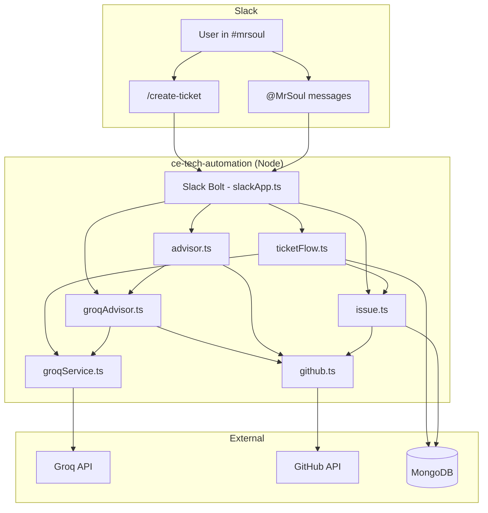

# MrSoul / CE-Tech Automation Platform — Full Guide

This document explains **what was built**, **how it works**, and **how to use it** for The Souled Store engineering team. It covers the original platform plus the **Groq AI layer**, **`/create-ticket` workflow**, and **PRD → GitHub** automation added in 2026.

---

## Table of contents

1. [What this platform is](#1-what-this-platform-is)
2. [High-level architecture](#2-high-level-architecture)
3. [How the app starts](#3-how-the-app-starts)
4. [Slack integration](#4-slack-integration)
5. [Three ways to get work tracked](#5-three-ways-to-get-work-tracked)
6. [Groq AI layer](#6-groq-ai-layer)
7. [`/create-ticket` flow (step by step)](#7-create-ticket-flow-step-by-step)
8. [Normal @MrSoul conversations](#8-normal-mrsoul-conversations)
9. [GitHub & TSS project integration](#9-github--tss-project-integration)
10. [PRD generation & attachment](#10-prd-generation--attachment)
11. [Developer matching & triage](#11-developer-matching--triage)
12. [Data storage (MongoDB)](#12-data-storage-mongodb)
13. [Configuration reference](#13-configuration-reference)
14. [Key source files](#14-key-source-files)
15. [Slack app setup checklist](#15-slack-app-setup-checklist)
16. [Example messages (copy-paste)](#16-example-messages-copy-paste)
17. [Troubleshooting](#17-troubleshooting)

---

## 1. What this platform is

**MrSoul** is a Slack bot (`ce-tech-automation`) that connects **Slack**, **GitHub** (`thesouledstore-tss/roadmap`), and the **TSS Product & Tech Master** project board to:

- Answer questions about **who is working on what**
- **Suggest owners** for new tasks (routing + triage)
- **Create GitHub issues** with TSS fields (priority, squad, effort, etc.)
- Run a **structured ticket flow**: problem review → PRD → approval → GitHub issue with PRD attached

The bot runs as a **Node.js / TypeScript** service with:

- **Slack Bolt** (Socket Mode for local dev)
- **MongoDB** for issues, routing, ticket sessions
- **Groq** (Llama) for AI: conversations, problem briefs, PRDs
- **Google ADK / Gemini** (optional) for PRD on every issue, intent classification, agent mode
- **Express** for health checks, API, GitHub webhooks

---

## 2. High-level architecture



### Request routing (simplified)

| User action | Handler | AI | Output |
|-------------|---------|-----|--------|
| `/create-ticket` | `createTicketHandlers.ts` → `ticketFlow.ts` | Groq | Thread: problem → PRD .docx → GitHub |
| `@MrSoul` question | `slackApp.ts` → `advisor.ts` → `groqAdvisor.ts` | Groq + live GitHub JSON | Thread reply |
| `@MrSoul #tag …` or `create issue` | `slackApp.ts` → `issue.ts` | Optional ADK summary/PRD | GitHub issue + tracking thread |
| Thread on ticket flow | `ticketFlow.handleThreadReply` | Groq (revise/PRD) | State machine updates |

---

## 3. How the app starts

Entry point: `src/index.ts`

1. Load `.env` via `src/config/index.ts` (Zod validation)
2. Connect **MongoDB**
3. Seed **routing mappings** (tag → developer)
4. Start **Express** on `PORT` (default 3000)
5. Start **Slack Bolt** in **Socket Mode** (`SLACK_APP_TOKEN`)
6. Subscribe **slack live ops** to activity feed (optional pipeline UI in thread)

Run locally:

```bash
npm install
cp .env.example .env   # if you have one; otherwise edit .env
npm run dev
```

---

## 4. Slack integration

### Socket Mode

The bot uses **Socket Mode** (no public URL required). You need:

- `SLACK_BOT_TOKEN` — bot OAuth token
- `SLACK_SIGNING_SECRET` — app signing secret
- `SLACK_APP_TOKEN` — app-level token with `connections:write`

### Monitored channels

Only messages in `SLACK_MONITORED_CHANNELS` (comma-separated channel IDs) are processed.

Example:

```bash
SLACK_MONITORED_CHANNELS=C0B577BMZGV
SLACK_BOT_USER_ID=U0B4ZJC9VM0
```

### Slash commands

| Command | Purpose |
|---------|---------|
| `/mrsoul` | Ephemeral guidelines + quick-action buttons |
| `/create-ticket` | Start structured ticket + PRD flow |

### Required OAuth scopes (bot)

| Scope | Why |
|-------|-----|
| `chat:write` | Post replies |
| `channels:history` | Read threads |
| `commands` | Slash commands |
| `files:write` | Upload PRD `.docx` to Slack |
| `views:write` | `/create-ticket` modal form |
| `pins:write` | Pin guidelines (optional) |

See also: `docs/SLACK_MRSOUL_SETUP.md`

---

## 5. Three ways to get work tracked

### A. Quick GitHub issue (hashtags)

Post in a monitored channel:

```
@MrSoul #backend Payment webhook failing for international cards #high
```

Or in a thread:

```
create issue: Same bug from yesterday, still reproducing on iOS
```

**Flow:** `issue.ts` → triage → `github.ts` create issue → Slack tracking thread → optional PRD (if `PRD_ON_EVERY_ISSUE` + ADK).

### B. Structured ticket + PRD (`/create-ticket`)

For product-style requests that need **review before filing**:

1. Problem summary (Groq) → **Approve / Reject / Comment**
2. PRD (Groq) → **`.docx` in Slack**
3. `Good to go raise this ticket to: <developer>` → **GitHub issue + PRD attached**

### C. Ask only (no issue)

```
@MrSoul who is working on what?
@MrSoul who should own affiliate link tracking?
```

**Flow:** Groq advisor with live GitHub context — no issue created unless you ask.

---

## 6. Groq AI layer

### What Groq is used for

| Feature | Service | Model (default) |
|---------|---------|-----------------|
| `/create-ticket` problem brief | `ticketFlow.ts` | `llama-3.3-70b-versatile` |
| PRD draft in ticket flow | `ticketFlow.ts` | same |
| Revise problem from comments | `ticketFlow.ts` | same |
| **All @MrSoul chat** | `groqAdvisor.ts` | same |

### How Groq is called

`src/services/groqService.ts` wraps the **OpenAI-compatible** Groq API:

- Base URL: `https://api.groq.com/openai/v1`
- `chat()` — plain text / markdown replies
- `chatJson()` — structured JSON (PRD schema, problem brief schema)
- **Daily budget:** `GROQ_MAX_CALLS_PER_DAY` (shared counter in MongoDB `LlmUsage`)

### Groq advisor (normal conversations)

`src/services/groqAdvisor.ts`:

1. Detects intent (workload, team roster, task suggestion, help)
2. **Fetches live data** in parallel:
   - Developer directory (routing + GitHub board)
   - Open project items
   - Workload by assignee
   - Routing tags
   - Triage (for “who should own…”)
   - Thread context (if replying in a thread)
3. Sends **system prompt + JSON context + user question** to Groq
4. Returns Slack **mrkdwn** blocks with footer: *Powered by Groq + live GitHub*

**Important:** Groq does **not** call GitHub itself during the chat — the app **pre-fetches** data and passes it as context. That keeps answers grounded in real board data.

### Fallback order (`advisor.ts`)

1. **Groq advisor** (if `GROQ_ADVISOR_ENABLED=true`)
2. **ADK agent** (if `ADK_ADVISOR_MODE=agent` and Gemini enabled)
3. **Deterministic** blocks (workload tables, triage list, guidelines)

---

## 7. `/create-ticket` flow (step by step)

### State machine

Stored in MongoDB: `TicketFlowSession`

| State | Meaning |
|-------|---------|
| `awaiting_approval` | Problem posted; waiting for approve/reject/comment |
| `prd_generating` | User approved; Groq writing PRD |
| `prd_ready` | PRD `.docx` uploaded; waiting for “raise ticket to …” |
| `issue_creating` | Creating GitHub issue |
| `completed` | Done |
| `rejected` / `cancelled` | User cancelled |

### Step 1 — Start

**Option A:** Slash + text

```
/create-ticket We need affiliate trackable links for influencers in DMs…
```

**Option B:** Slash only → modal with textarea

Handler: `src/handlers/createTicketHandlers.ts`  
Logic: `src/services/ticketFlow.ts` → `startFlow()`

Groq returns JSON: `title`, `summary`, `keyQuestions`, `suggestedScope`.

Bot posts a **thread** with **Approve** / **Reject** buttons.

### Step 2 — Review problem

| Action | What happens |
|--------|----------------|
| Click **Approve** or reply `approve` | Groq generates PRD → uploads `.docx` to Slack |
| Click **Reject** or reply `reject` | Flow cancelled |
| Reply with feedback | Groq revises problem summary → new review message |

Parser utilities: `src/utils/ticketFlowParser.ts`  
- Handles typos (`riase` → `raise`)  
- Parses `Good to go raise this ticket to: …`

### Step 3 — PRD in Slack

- File uploaded via `slack.ts` → `files.uploadV2`
- Built by `src/services/prdDocx.ts` (npm package `docx`)
- PRD structure matches `src/agents/schemas.ts` → `prdSchema`

### Step 4 — Raise GitHub issue

```
Good to go raise this ticket to: tss-devanshsaxena
```

or

```
Good to go raise this ticket to: Devansh Saxena
```

- **Developer match:** `developerMatch.ts` (full name, `tss-*` login, disambiguation for duplicate first names)
- **Issue creation:** `issue.ts` with `forcedAssignment`, `prdAppendix`, `trackingThreadTs`
- **PRD on GitHub:** see [section 10](#10-prd-generation--attachment)

### Confirmation

Bot posts:

- “Ticket raised on GitHub” blocks with issue link + assignee
- Note that PRD is on the issue
- `.docx` again in Slack thread (optional duplicate)

---

## 8. Normal @MrSoul conversations

### Requirements

- Message in a **monitored channel**
- Usually **`@MrSoul`** in the message (or “what is X working on” without @)
- `GROQ_ADVISOR_ENABLED=true` and valid `GROQ_API_KEY`

### What you can ask

- Workload: `@MrSoul what is tss-akritiraj working on?`
- Team: `@MrSoul who is working on what?`
- Ownership: `@MrSoul who should work on size chart Excel upload?`
- General: `@MrSoul is there anything on the board about payments?`
- Thread follow-up: `@MrSoul summarize this thread and suggest an owner`

### What the bot knows (in context)

- Repo: `thesouledstore-tss/roadmap`
- TSS project board items (titles, assignees, status, URLs)
- Routing map (`#refund` → owner, etc.)
- Triage scores when you describe a task
- Prior thread messages (in threads)

### What it does **not** do automatically

- Reply to messages **without** @MrSoul (unless workload regex matches)
- Create issues unless you use hashtags, `create issue`, or `/create-ticket` flow

---

## 9. GitHub & TSS project integration

### Repository

Configured in `.env`:

```bash
GITHUB_OWNER=thesouledstore-tss
GITHUB_REPO=roadmap
GITHUB_TOKEN=ghp_...
```

### Issue creation (`github.ts`)

- Title from message text (priority prefix if `#critical` / `#urgent`)
- Body: summary, TSS checklist, Slack link, reporter, CE-Tech ID
- Labels: `ce-tech-auto`, priority, squad, etc.
- Assignee from triage or ticket flow override
- **Project v2 fields** applied via GraphQL (`applyIssueGuidelines`)

### TSS guidelines

`src/services/issueGuidelines.ts` + `src/content/tssIssueGuidelines.ts`

Hashtags control metadata:

- `#critical` / `#p0` → P0  
- `#squad-backend` → Squad field  
- `#effort-5` → Fibonacci effort  
- `#parent-123` → Epic link  

### Webhooks

Express route `POST /webhooks/github` — PR events update issue status and Slack threads.

---

## 10. PRD generation & attachment

### Two PRD paths

| Path | Engine | When |
|------|--------|------|
| Ticket flow | **Groq** | `/create-ticket` after approve |
| Per-issue / `#prd` | **ADK / Gemini** (if enabled) | `PRD_ON_EVERY_ISSUE` or `#prd` |

### GitHub PRD attachment (ticket flow)

After issue is created, `github.ts` → `attachPrdToIssue()`:

1. **Issue body** — full PRD markdown (`formatPrdPlainText`)
2. **GitHub comment** — PRD markdown + download link
3. **Repo file** — `docs/prds/issue-<N>/PRD-<slug>.docx` via Contents API

Requires `GITHUB_TOKEN` with **`repo`** scope (write contents).

If upload fails, PRD still appears in the **issue comment** as markdown.

### Slack PRD

- Ticket flow: `.docx` in thread after approve  
- Quick issues: `slack.ts` → `postPrdDraft()` (Block Kit summary + optional Claude handoff)

---

## 11. Developer matching & triage

### Triage (`triage.ts`)

Signals (scores):

- Slack @mention of routed owner  
- Hashtag domain match (`#refund` → mapping)  
- GitHub project title match  
- Workload penalty / recent activity  

### Developer match (`developerMatch.ts`)

Used when user says “raise ticket to Devansh Saxena”:

- Exact `tss-*` login  
- First / full name fuzzy match  
- **Disambiguation** when multiple “Devansh” — prefers login containing surname (e.g. `saxena` in `tss-devanshsaxena`)

### Routing (`routing.ts`)

MongoDB `DeveloperMapping`: tag → Slack user + GitHub login. Cached 5 minutes.

---

## 12. Data storage (MongoDB)

| Collection | Purpose |
|------------|---------|
| `Issue` | CE-Tech issue records, GitHub ref, Slack thread |
| `DeveloperMapping` | Hashtag → owner routing |
| `TicketFlowSession` | `/create-ticket` state (TTL on `expiresAt`) |
| `DedupeCache` | Prevent duplicate Slack → issue processing |
| `LlmCache` / `LlmUsage` | LLM/ADK/Groq cache and daily call counts |

---

## 13. Access control (email allowlist)

Only approved `@thesouledstore.com` emails can use MrSoul. See **`docs/MRSOUL_ACCESS_CONTROL.md`**.

| Role | Grant access | Remove users (`revoke access`) |
|------|--------------|--------------------------------|
| Super Admin (devansh.saxena@…) | Yes | Yes |
| Admin (rahul.jaisheel@…) | Yes (`member` / `admin`) | No |
| Member | No | No |

```
@MrSoul grant access new.person@thesouledstore.com member
@MrSoul revoke access old.person@thesouledstore.com   # super admin only
```

Requires Slack scope `users:read.email` and `ACCESS_CONTROL_ENABLED=true`.

---

## 14. Configuration reference

### Slack

| Variable | Description |
|----------|-------------|
| `SLACK_BOT_TOKEN` | Bot OAuth token |
| `SLACK_SIGNING_SECRET` | Signing secret |
| `SLACK_APP_TOKEN` | Socket Mode app token |
| `SLACK_MONITORED_CHANNELS` | Channel IDs (comma-separated) |
| `SLACK_BOT_USER_ID` | Bot user ID (ignore own messages) |
| `SLACK_LIVE_OPS_ENABLED` | Live pipeline message in thread |

### Groq

| Variable | Description |
|----------|-------------|
| `GROQ_ENABLED` | Master switch |
| `GROQ_API_KEY` | Groq API key |
| `GROQ_MODEL` | Default `llama-3.3-70b-versatile` |
| `GROQ_ADVISOR_ENABLED` | AI for @MrSoul chat |
| `GROQ_MAX_CALLS_PER_DAY` | Budget (default 150) |
| `TICKET_FLOW_ENABLED` | `/create-ticket` |

### GitHub

| Variable | Description |
|----------|-------------|
| `GITHUB_TOKEN` | PAT with `repo`, issues, project |
| `GITHUB_OWNER` / `GITHUB_REPO` | Target repo |
| `GITHUB_PROJECT_ORG` / `GITHUB_PROJECT_NUMBER` | Projects v2 |
| `GITHUB_FALLBACK_ASSIGNEE` | If assignee not allowed |

### ADK (optional)

| Variable | Description |
|----------|-------------|
| `ADK_ENABLED` | Gemini agents |
| `GEMINI_API_KEY` | Google AI key |
| `ADK_ADVISOR_MODE` | `deterministic` or `agent` |
| `PRD_ENABLED` / `PRD_ON_EVERY_ISSUE` | Auto-PRD on issues |

---

## 15. Key source files

```
src/
├── index.ts                 # Bootstrap
├── handlers/
│   ├── slackApp.ts          # Main Slack message router
│   └── createTicketHandlers.ts  # /create-ticket slash + modal + buttons
├── services/
│   ├── groqService.ts       # Groq API client + budget
│   ├── groqAdvisor.ts       # @MrSoul AI conversations
│   ├── ticketFlow.ts        # /create-ticket state machine
│   ├── advisor.ts           # Advisor orchestration + fallbacks
│   ├── issue.ts             # Slack → GitHub issue pipeline
│   ├── github.ts            # GitHub API + PRD attach
│   ├── slack.ts             # Slack API helpers
│   ├── triage.ts            # Assignee scoring
│   ├── routing.ts           # Tag → developer mappings
│   ├── developerMatch.ts    # Name/login matching
│   ├── prdDocx.ts           # Word document builder
│   ├── prdService.ts        # ADK PRD (optional)
│   └── adkService.ts        # Gemini ADK agents
├── utils/
│   └── ticketFlowParser.ts  # approve / raise / typos
├── content/
│   ├── ticketFlowBlocks.ts  # Slack blocks for ticket flow
│   ├── prdBlocks.ts         # PRD Slack + markdown
│   └── mrsoulGuidelines.ts  # Help text
├── agents/                  # ADK agent definitions (Gemini)
└── config/index.ts          # Env validation
```

---

## 16. Slack app setup checklist

1. Create app at [api.slack.com/apps](https://api.slack.com/apps)  
2. Enable **Socket Mode** → `SLACK_APP_TOKEN`  
3. Add **Bot scopes** (see section 4)  
4. Create slash commands: `/mrsoul`, `/create-ticket`  
5. Install app to workspace → copy `SLACK_BOT_TOKEN`  
6. Invite bot to `#mrsoul` (or your channel)  
7. Set `SLACK_MONITORED_CHANNELS` to channel ID  
8. Set `SLACK_BOT_USER_ID` from bot profile  
9. Configure `.env` (Groq, GitHub, MongoDB)  
10. `npm run dev`  

---

## 17. Example messages (copy-paste)

### Normal chat

```
@MrSoul who is working on what?
@MrSoul what is tss-vishwasbellani working on?
@MrSoul who should own bulk size chart upload from Excel?
```

### Quick issue

```
@MrSoul #feature #squad-backend Affiliate tracking links for influencer DMs
```

### Full ticket flow

```
/create-ticket We need trackable affiliate links when influencers share product URLs in Instagram DMs. Need reporting per influencer.
```

Then in thread:

```
approve
```

After `.docx` appears:

```
Good to go raise this ticket to: tss-devanshsaxena
```

---

## 18. Troubleshooting

| Problem | Check |
|---------|--------|
| Bot never replies | Channel ID in `SLACK_MONITORED_CHANNELS`? Bot invited? `npm run dev` running? |
| “Thinking…” then silence | `GROQ_API_KEY` valid? `GROQ_MAX_CALLS_PER_DAY` not exceeded? Logs in terminal |
| `/create-ticket` no modal | `views:write` scope + reinstall app |
| No `.docx` in Slack | `files:write` scope |
| PRD not on GitHub | `GITHUB_TOKEN` needs `repo` scope; see issue **comments** for markdown fallback |
| Wrong assignee | Use full `tss-*` login: `Good to go raise this ticket to: tss-devanshsaxena` |
| “Reply with Good to go…” loop | Typo in “raise”; fixed in `ticketFlowParser.ts` — restart bot |
| Duplicate Devansh | Use `tss-login` or full name with surname |

### Logs

Watch the terminal running `npm run dev` for:

- `ticket-flow` — ticket sessions  
- `groq-advisor` — chat replies  
- `github` — issue # and PRD upload  
- `issue-service` — full pipeline  

---

## Summary

| Capability | Built with |
|------------|------------|
| Slack bot + Socket Mode | `@slack/bolt`, `slackApp.ts` |
| Live GitHub context in chat | `groqAdvisor.ts` + `githubService` |
| `/create-ticket` PRD workflow | `ticketFlow.ts` + Groq + `docx` |
| GitHub issues + TSS board | `issue.ts`, `github.ts`, `issueGuidelines.ts` |
| PRD on GitHub | Body + comment + `docs/prds/…docx` |
| Developer routing | `routing.ts`, `triage.ts`, `developerMatch.ts` |
| Persistence | MongoDB models in `models/index.ts` |

For day-to-day Slack setup steps, see **`docs/SLACK_MRSOUL_SETUP.md`**.

---

*Document generated for the CE-Tech / MrSoul automation codebase. Update this file when adding new flows or env variables.*
